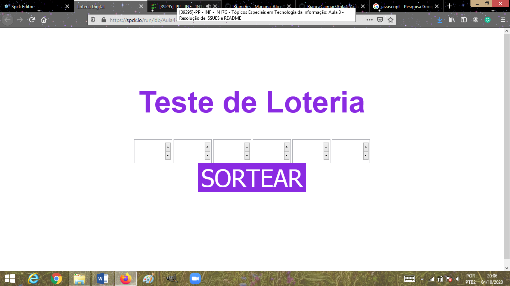
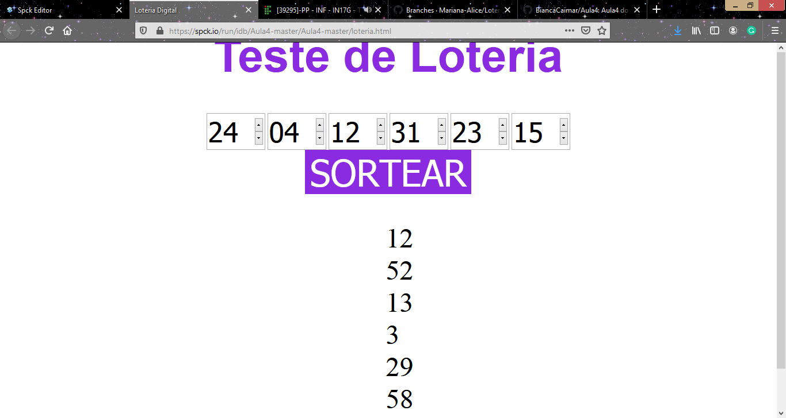

# Simulador e Loteria

Este trabalho/ projeto que simula a *mega-sena*, onde o usuário digita seis números.

Após ser digitado, é feito o sorteo aleatório de seis números e comparamos para serem verificados.

Resultando o tota de acertos feitos.

**Não é um simulador real**

## Tecnologias utilizadas

1. **HTML:** É uma linguagem de marcação utilizada na construção de páginas na Web. Documentos HTML podem ser interpretados por navegadores. A tecnologia é fruto da junção entre os padrões HyTime e SGML. HyTime é um padrão para a representação estruturada de hipermídia e conteúdo baseado em tempo.
2. **CSS:** É um mecanismo para adicionar estilo a um documento web. O código CSS pode ser aplicado diretamente nas tags ou ficar contido dentro das tags <style>. Também é possível, em vez de colocar a formatação dentro do documento, criar um link para um arquivo CSS que contém os estilos.
3. **Javascript:** É uma linguagem de programação interpretada estruturada, de script em alto nível com tipagem dinâmica fraca e multiparadigma. Juntamente com HTML e CSS, o JavaScript é uma das três principais tecnologias da World Wide Web.
4. **~~Jquery~~** Não utilizado.

## Funções principais

As suas principais funções do projeto a seguir...

### Sorteio de número

```
  function sortearNumeros() {
    numSort = [];
    let sort;
    for (var i = 0; i < 6; i++) {
      do {
        sort = Math.ceil(Math.random() * 60);
        sort = (sort == 0) ? 1 : sort;
      }while(numSort.includes(sort));
      numSort.push(sort);
    }
  }
```

### Lendo os números digitados

```
  function addToList(num, pos) {
    if (num.length == 2) {
      if (numEsco.includes(num)) {
        alert("Numero Escolhido Anteriormente!! Digite outro numero!")
      }else if(parseInt(num) > 60){
        alert("O numero digitado não pode ser maior que 60");
      }else{
        numEsco[pos -1] = num;
      }
    }
  }
```

## Como rodar o código
> Simplesmente baixe o código e abra o arquivo
**_loteria.html_** no seu navegador

## Exemplo de tabela

|Exemplo | Valor de exemplo | Quantidade 
|--------|------------------|------------
|Exemplo1|R$ 10             | 5
|Exemplo2|R$ 8              | 4
|Exemplo3|R$ 7              | 34
|Exemplo4|R$ 8              | 23

## Imagens do código

Tela1

Tela2


#### Referências

* HTML: 
* CSS: 
* Javascript: # Loteria-Aula3
